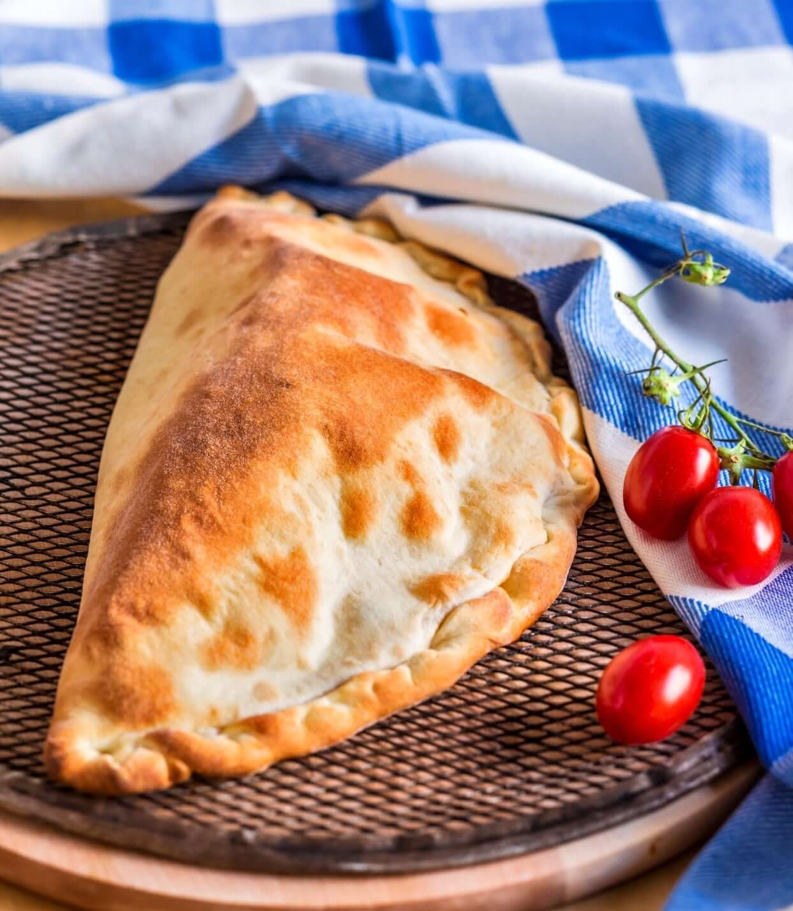

# Menu

## Pizze klasyczne

|Lp.| Pizza:                                                                           | rozmiar:           | 30 cm | 50 cm | 60 cm |
|---|----------------------------------------------------------------------------------|--------------------|-------|-------|-------|
|1. |MARGHERITA (sos pomidorowy, ser, oregano)                                         |                    | 20 zł | 40 zł | 50 zł |
|2. |FUNGHI (sos pomidorowy, ser, pieczarki)                                           |                    | 22 zł | 42 zł | 52 zł |
|3. |SALAMI (sos pomidorowy, ser mozarella, salami)                                    |                    | 23 zł | 43 zł | 53 zł |
|4. |VESUVIO (sos pomidorowy, podwójny ser , szynka)                                   |                    | 24 zł | 44 zł | 54 zł |
|5. |HAWAJSKA (sos pomidorowy, ser, szynka, ananas)                                    |                    | 25 zł | 45 zł | 55 zł |
|6. |MILANO (sos pomidorowy, ser, szynka, papryka, oregano)                            |                    | 26 zł | 46 zł | 56 zł |
|7. |KEBAB (sos pomidorowy, ser, kebab, sos czosnkowy)                                 |                    | 26 zł | 46 zł | 56 zł |
|8. |QUATTRO FROMAGGI (sos pomidorowy, 4 sery, oregano)                                |                    | 27 zł | 47 zł | 57 zł |
|9. |GRECKA (sos pomidorowy, ser, oliwki, feta, sałata lodowa)                         |                    | 28 zł | 48 zł | 58 zł |
|10.|BARBEQUE (sos pomidorowy, ser, kurczak, boczek, cebula, sos barbeque, oregano)    |                    | 30 zł | 50 zł | 60 zł |

## Pizze wegetariańskie 

|Lp.| Pizza:                                                                           | rozmiar:           | 30 cm | 50 cm | 60 cm |
|---|----------------------------------------------------------------------------------|--------------------|-------|-------|-------|
|1. |MARGHERITA (sos pomidorowy, ser, oregano)                                         |                    | 20 zł | 40 zł | 50 zł |
|2. |FUNGHI (sos pomidorowy, ser, pieczarki)                                           |                    | 22 zł | 42 zł | 52 zł |
|3. |HAWAJSKA VEGE (sos pomidorowy, ser, ananas)                                       |                    | 25 zł | 45 zł | 55 zł |
|4. |MILANO VEGE (sos pomidorowy, ser, papryka, oregano)                               |                    | 26 zł | 46 zł | 56 zł |
|5. |GRECKA (sos pomidorowy, ser, oliwki, feta, sałata lodowa)                         |                    | 26 zł | 46 zł | 56 zł |

## Pizza calzone - zwinięta w pieróg

|Lp.| Nazwa:                                                                           | rozmiar:           | 30 cm | 50 cm | 60 cm |
|---|----------------------------------------------------------------------------------|--------------------|-------|-------|-------|
|1. |KEBAB (sos pomidorowy, ser, kebab, sos czosnkowy)                                 |                    | 26 zł | 46 zł | 56 zł |
|2. |GRECKA (sos pomidorowy, ser, oliwki, feta, sałata lodowa)                         |                    | 28 zł | 48 zł | 58 zł |
|3. |BARBEQUE (sos pomidorowy, ser, kurczak, boczek, cebula, sos barbeque, oregano)    |                    | 30 zł | 50 zł | 60 zł |

## Makarony

|Lp.| Nazwa:                                                               | porcja:            | 500 g | 650 g | 
|---|----------------------------------------------------------------------|--------------------|-------|-------|
|1. |SPAGHETTI NAPOLI (makaron z sosem pomidorowym i serem)                |                    | 30 zł | 50 zł | 
|2. |SPAGHETTI BOLONIA (makaron z sosem bolońskim)                         |                    | 20 zł | 46 zł | 
|3. |SPAGHETTI CARBONARA (makaron z sosem carbonara)                       |                    | 28 zł | 48 zł | 
